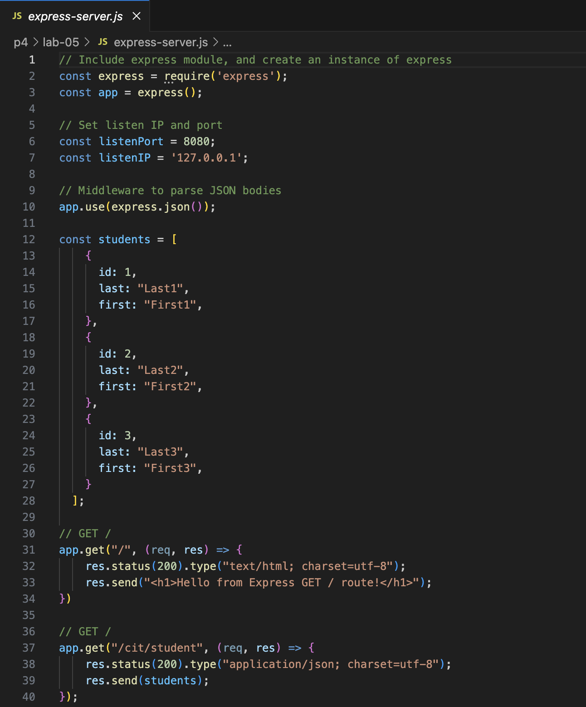
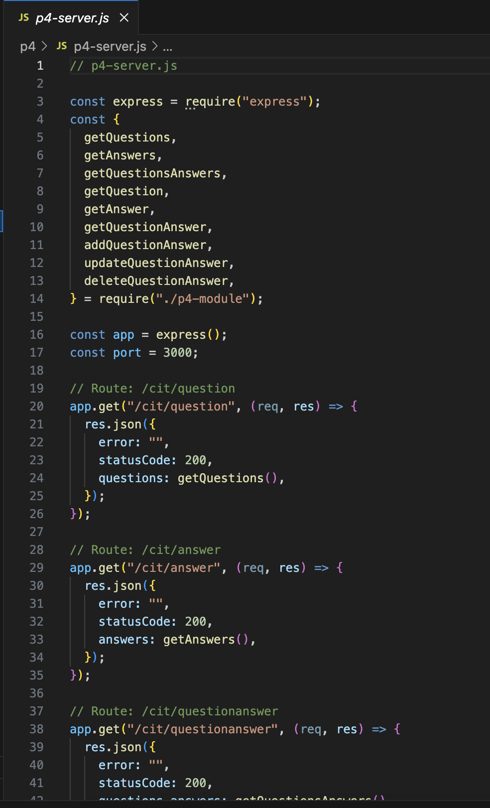

# CIT 281 Project 4

## Lab 5
Purpose: Learn to set up and test a Node.js Express server with RESTful GET and POST routes using Postman, and manage JSON data, including an array of student objects.

Technologies: Node.js, Express, Postman, JavaScript (ES6+), VSCode

Learned: Installing and using Postman for API testing, creating Express server routes for GET and POST, handling JSON requests and responses, managing in-memory data arrays, and validating server responses through Postman.

## Project 4
Purpose: Build a Node.js REST API that manages a question and answer data source by creating a code module to handle data operations, testing the module independently, and implementing Express routes to handle GET requests.

Technologies: Node.js, JavaScript (ES6+), Express, Postman (for testing), VSCode

Learned: How to modularize data handling code, perform deep cloning of data, write REST API endpoints using Express GET verbs, test module functions separately, handle JSON data, and validate input for robustness.

